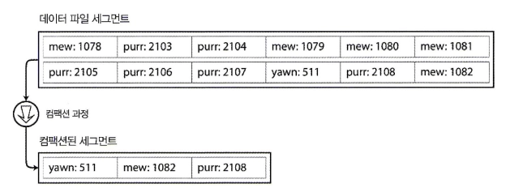
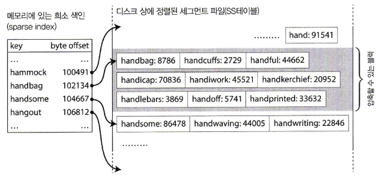
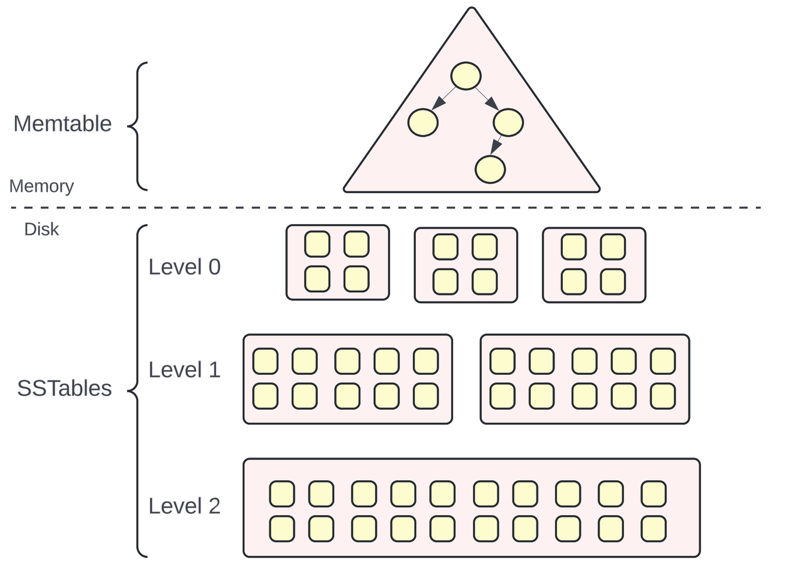
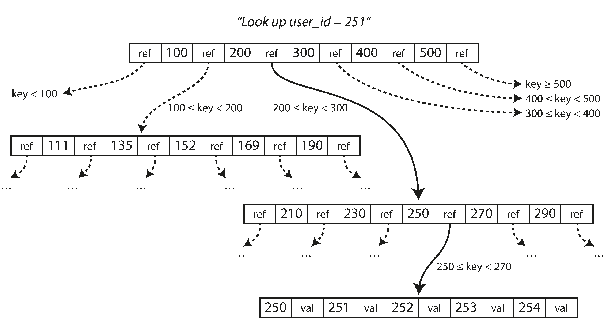

# 목표

데이터를 어떤 용도로 쓰느냐(OLTP/OLAP)에 따라 저장소 엔진이 어떻게 동작하고 어떤 장단점을 갖는지 파악해, 상황에 맞는 엔진을 고를 수 있도록 한다.

# OLTP vs OLAP

**Online Transaction Processing**

- 네트워크상의 여러 사용자가 실시간으로 데이터베이스의 데이터를 삽입, 갱신, 삭제하는 등 소규모 트랜잭션을 빠르고 정확하게 처리하는 시스템 방식
- 요청 하나당 레코드 몇 개만 인덱스로 빠르게 찾아 읽고 쓴다
- 일반 사용자(고객)가 서비스를 쓰면서 발생
- 예) 입출금 거래, 쿠폰 발급, 블로그 댓글

**Online Analytical Processing**

- 대량 레코드를 스캔해 소수 컬럼을 집계하는 분석용 처리
- 회사 내부 분석가나 경영진이 의사결정을 위해 사용
- 예) 월별 매출, 쿠폰 사용률

초기엔 한 DB에서 거래와 분석을 같이 했지만, 데이터가 커지고 여러 시스템으로 흩어지면서 분석 쿼리가 운영에 부담을 주자 분석 전용 DB를 따로 두게 됨. 이 분석 전용 DB를 데이터 웨어하우스라고 함.

# 디스크 I/O

데이터베이스는 결국 디스크에 물리적으로 데이터를 저장한다. 이 디스크에서 데이터를 읽고 쓰는 동작을 **디스크 I/O**라고 하는데, 이게 매우 느리다. 메모리와 비교하면 HDD는 대략 10만 배 정도 느리다.

디스크 I/O가 느리기 때문에, 한 바이트씩 가져오지 않고 **블록(block) 단위**로 한 번에 가져온다.

그런데 이 블록들이 디스크 상에서 어떻게 배치되어 있느냐에 따라 접근 속도가 크게 갈린다.

- 순차 접근: 디스크 헤드를 이동시키지 않고 연속된 블록을 읽는 것. 매우 빠름.
- 랜덤 접근: 매번 위치를 옮겨가며 읽는 것. 훨씬 느림.

그래서 저장 엔진의 목표는 "쓰기는 최대한 순차적으로, 읽기는 최대한 적은 접근으로"가 되고, 이 방향으로 DB 엔진들이 발전해왔다.

# 로그 구조 계열

## 로그

파일 끝에 레코드를 추가(append)만 하는 저장 방식.

**장점**

- 데이터를 덮어쓰지 않고 끝에 순차적으로 쓰기 때문에 쓰기 성능이 좋다.

**단점**

- 키를 찾으려면 수정·삭제된 옛 값까지 포함한 파일 전체를 훑어야 한다 (O(n)).
- 수정·삭제도 새 레코드로 추가되는 방식이라, 옛 값을 지우지 않고 계속 쌓이기만 해서 용량이 커진다.

조회 성능 문제는 색인으로 보완할 수 있다. 다만 색인은 별도 구조를 함께 갱신해야 하므로 쓰기에 오버헤드가 발생한다.

## 해시 색인 (Bitcask)

키를 디스크 오프셋(파일 내 바이트 위치)에 매핑한 인메모리 해시맵. 해시맵 조회는 O(1)이라 매우 빠르다.

**동작**

- 쓰기: 로그 끝에 레코드를 추가하고, 해시맵의 오프셋을 갱신
- 읽기: 해시맵에서 오프셋을 찾아 디스크 접근 한 번으로 값을 가져옴 (파일을 훑을 필요 없이, 해시맵이 알려주는 위치로 바로 감)

**장점**

- 조회당 디스크 접근이 한 번뿐이라 읽기가 빠르다.
- 쓰기는 순차 추가 + 오프셋 갱신뿐이라 쓰기도 빠르다.

**적합한 상황** 각 키의 값이 자주 갱신되는 경우. 갱신이 잦아도 키 개수는 늘지 않아 메모리 제약을 건드리지 않고, 쓰기 비용도 낮다. 예) 키가 동영상 URL, 값이 재생 수인 경우

**한계**

- 모든 키가 메모리에 들어가야 한다. 키 개수 자체가 매우 많아지면(수억 개 등) 해시맵이 메모리 용량을 초과할 수 있다.
- 범위 조회가 불가능하다. 해시는 키를 흩뿌리므로 인접한 키의 위치를 알 수 없다.

## 세그먼트와 컴팩션

파일에 옛 값이 계속 쌓이기만 하면 결국 용량이 부족해진다. 그래서 **컴팩션(compaction)** 을 한다 — 파일을 읽어서 중복된 키를 버리고 각 키의 최신 값만 남기는 작업이다.

문제는 쓰는 중인 로그는 컴팩션하기 어렵다는 것이다. 로그가 계속 변하니까 "전체"를 정할 수 없고, 정리하는 사이에 값이 바뀌어 결과가 어긋난다.

그래서 로그를 일정 크기로 잘라 **세그먼트(segment)** 단위로 관리한다. 특정 크기가 되면 세그먼트 파일을 닫고 새 세그먼트에서 쓰기를 이어가며, 닫힌 세그먼트는 더 이상 수정하지 않는다. 닫힌 세그먼트는 변하지 않으므로 안전하게 컴팩션할 수 있고, 그동안 쓰기는 새 세그먼트에서 계속된다.

 
**컴팩션 과정**

1. 백그라운드 스레드가 닫힌 세그먼트를 읽어 새 파일에 결과를 쓴다. 이 과정에서 읽기 요청은 옛 세그먼트를 본다.
2. 병합이 끝나면 읽기 요청을 새 세그먼트로 전환한다.
3. 옛 세그먼트를 제거한다.

여기까지가 로그 + 해시 색인 + 세그먼트/컴팩션 구조다. 그런데 해시 색인의 두 한계(범위 조회 불가, 모든 키가 메모리에 있어야 함)는 여전히 남아있다.

## SS테이블 (Sorted String Table)

세그먼트를 키로 정렬해서 저장한 것. 해시 색인의 두 한계를 해결하기 위함이다.

- **범위 조회 불가** → 키로 정렬되어 있으니, 시작 키 위치만 찾으면 그 뒤를 순차적으로 읽으면 된다.
- **모든 키가 메모리에 있어야 함** → 정렬되어 있으니 색인에 키를 드문드문만 담아도 된다 (**희소 색인**).

**희소 색인** 모든 키를 색인에 담지 않고, 일정 간격으로만 담는 방식.

- `handiwork`라는 값을 찾으려 할 때, 색인이 정렬되어 있기 때문에 `handbag`과 `handsome` 사이에 있다는 걸 알 수 있고, 해당 구간만 스캔하면 된다.
- 덕분에 색인 크기가 훨씬 작아져 메모리 제약에서 자유로워진다.

다만 문제는, 쓰기는 순서 없이 들어오는데 세그먼트를 어떻게 정렬된 상태로 만드느냐다.

## LSM 트리 (Log-Structured Merge Tree)

멤테이블, SS테이블, 컴팩션을 묶은 구조.

**쓰기**

1. 요청이 오면 메모리의 균형 트리(레드-블랙 트리 등)에 정렬된 상태로 저장. 이 메모리 구조를 **멤테이블(memtable)** 이라고 한다.
2. 멤테이블이 임계 크기를 넘으면 정렬된 상태 그대로 디스크에 SS테이블로 쓴다.
3. 이후 쓰기는 새 멤테이블에서 받는다.

멤테이블은 메모리에 있어 크래시 시 유실될 수 있으므로, 쓰기 요청이 오면 멤테이블과 함께 디스크의 로그에도 추가한다. 이 로그는 크래시 복구용이며, 멤테이블이 SS테이블로 저장되면 버린다.

**읽기** 멤테이블 → 최신 SS테이블 → 그다음 SS테이블 순으로 찾는다. 최신 값이 앞쪽에 있으므로 먼저 찾은 값이 정답이다.

없는 키를 찾을 때는 멤테이블부터 가장 오래된 SS테이블까지 전부 확인해야 "없다"는 걸 알 수 있다. 이를 완화하기 위해 **블룸 필터(Bloom filter)** 를 둔다 — 특정 키가 "확실히 없다" 또는 "있을 수도 있다"를 빠르게 판단하는 구조로, 확실히 없는 키는 디스크를 건드리지 않고 바로 거른다.

**컴팩션** 백그라운드에서 SS테이블들을 병합해 각 키의 최신 값만 남긴다. 전략에 따라 쓰기 부담과 조회 성능·공간 효율 사이의 트레이드오프가 있다.

**디스크 I/O 관점**

- **쓰기**: 요청마다 디스크에 흩어 쓰지 않고, 멤테이블에 모았다가 한 번에 내려쓴다. 요청 시 남기는 복구용 로그도 append라 순차 쓰기다. 제자리 갱신이 없으므로 디스크 쓰기는 항상 순차다.
- **읽기**: 여러 SS테이블을 확인해야 해서 불리하므로, 디스크 접근 전에 메모리에서 최대한 거른다.
    - 블룸 필터: "이 파일에 없다"를 메모리에서 판단해 디스크 접근 자체를 건너뜀
    - 희소 색인: 파일 전체가 아니라 블록 하나만 읽도록 위치를 좁힘
- **대가**: 컴팩션이 같은 데이터를 반복해서 다시 쓰므로(**쓰기 증폭**) 디스크 대역폭을 소모한다. 쓰기가 몰리면 일반 요청과 경합해 지연이 튈 수 있다.

**사용하는 DB**

- LevelDB, RocksDB — 임베디드 엔진. 다른 DB가 내장해서 쓰기도 함
- Cassandra, HBase — 분산 DB
- InfluxDB 등 — 시계열

# 페이지 지향 계열

LSM 트리가 쓰기에 유리하다면, B트리는 읽기에 유리하다. B트리가 왜 읽기에 강한지, 그리고 왜 쓰기에서 손해를 보는지 구조로 따라가보자.

## B 트리

디스크를 고정 크기 **페이지**로 나누고, 트리의 노드 하나를 페이지 하나에 담는다. 앞서 디스크는 블록 단위로 읽는다고 했는데, 그 블록에 맞춘 단위가 페이지다. (InnoDB 16KB, PostgreSQL 8KB)

페이지에는 키와 자식 페이지 참조가 함께 들어간다. 이 자식 참조 개수를 **분기 계수**라고 한다. 한 페이지에 키를 수백 개 담을 수 있으므로, 한 번의 I/O로 탐색 범위를 수백 분의 1로 줄인다.

분기 계수가 크면 트리가 얕아진다. 분기 계수 500이면 깊이 4로 키 600억 개. 트리의 깊이가 곧 I/O 횟수이므로, 데이터가 커져도 몇 번이면 조회가 끝난다.

비교로, 이진 트리(AVL, 레드-블랙)는 자식이 2개뿐이라 같은 데이터에서 깊이가 30까지 깊어진다. 메모리에서는 문제없지만 디스크에서는 I/O가 30번이라 쓸 수 없다.

**조회** 루트에서 키 범위를 따라 자식 페이지를 타고 리프까지 내려간다.

**갱신과 추가**

- 갱신: 리프 페이지를 찾아 제자리에서 덮어쓴다 (**in-place update**). 키마다 저장 위치가 정해져 있어서 그 위치를 찾아가 써야 하므로, 로그 구조와 달리 랜덤 쓰기가 된다.
- 추가: 들어갈 페이지에 공간이 없으면 페이지를 둘로 나누고(**분할**), 부모 페이지에 참조를 추가한다.

**신뢰성** 분할은 여러 페이지를 한꺼번에 수정하므로 중간에 크래시가 나면 트리가 깨질 수 있다. 그래서 페이지를 수정하기 전에 변경 내용을 **WAL(Write-Ahead Log)** 에 먼저 기록하고, 크래시 시 이 로그로 복구한다. (LSM의 복구용 로그와 같은 역할)

**왜 색인에 뛰어난가** 디스크는 블록 단위로 읽고, I/O 한 번이 비싸다. 그럼 색인은 "**I/O 몇 번 만에 원하는 키를 찾을 수 있냐**"가 전부다.

1. **정렬을 유지한다** — SS테이블처럼 키가 정렬돼 있으니 범위 조회가 되고, 이진 탐색이 된다. 해시 색인의 한계가 처음부터 없다.
2. **페이지 = 디스크 블록** — 노드 하나를 디스크 블록 크기에 맞춘다. I/O 한 번에 노드 하나를 통째로 가져오니 낭비가 없다.
3. **분기 계수가 크다** — 트리가 극단적으로 얕아서 깊이 = I/O 횟수가 3~4번으로 고정된다.
4. **키 위치가 한 곳** — LSM은 최신값이 어느 SS테이블에 있는지 몰라 여러 파일을 뒤지지만, B트리는 키마다 자리가 딱 하나다. 읽기 경로가 항상 같아서 성능이 예측 가능하다.

이 네 가지 때문에 "디스크 위에 놓는 정렬 색인"으로는 B트리가 표준이 됐고, 대부분의 관계형 DB가 B트리를 쓴다.

**디스크 I/O 관점**

- **읽기**: 키마다 저장 위치가 정확히 한 곳이라, 트리 깊이만큼만 I/O로 찾는다. 여러 파일을 뒤지지 않으므로 읽기 성능이 안정적이다.
- **쓰기**: 제자리 갱신이라 키가 속한 페이지 위치로 매번 찾아가 덮어쓴다 → 랜덤 쓰기. 페이지 일부만 바뀌어도 페이지 전체를 다시 쓰고, WAL에도 한 번 더 쓴다.
- **대가**: 쓰기 성능이 LSM보다 낮고, 페이지 분할이 반복되면 페이지 안에 빈 공간이 생겨 공간 효율도 떨어진다.

**사용하는 DB**

- MySQL(InnoDB), PostgreSQL, Oracle — 대부분의 관계형 DB
- MongoDB(WiredTiger 기본 설정), SQLite

# B트리 vs LSM 트리

||B트리|LSM 트리|
|---|---|---|
|쓰기|제자리 갱신 → 랜덤 쓰기|멤테이블에 모아 순차 쓰기|
|읽기|키 위치 한 곳, 깊이만큼만 I/O|여러 SS테이블 확인 (블룸 필터로 완화)|
|대가|쓰기 느림, 페이지 빈 공간|컴팩션의 쓰기 증폭, 지연 튐|
|유리한 경우|읽기 위주, 트랜잭션|쓰기 폭주, 시계열·로그|

정답은 없고 워크로드에 달렸다. 책도 "직접 측정해보라"고 한다.

# 그 밖의 색인 구조

- **기본 키 색인 vs 보조 색인(secondary index)**: 기본 키 색인은 키가 유일하지만, 보조 색인은 같은 값을 가진 로우가 여러 개일 수 있다. 그래서 값에 로우 식별자 목록을 담거나, 로우 식별자를 키에 붙여서 유일하게 만든다.
- **색인에 값을 어디까지 담을까**
    - 힙 파일 참조: 색인은 위치만 갖고, 실제 로우는 별도 파일(힙)에 있다. 색인 여러 개가 같은 로우를 가리킬 수 있어 중복이 없다.
    - **클러스터드 색인**: 색인 안에 로우 전체를 넣는다. 색인만 읽으면 끝나서 빠르다. (InnoDB의 기본 키가 이 방식)
    - **커버링 색인**: 로우 전체는 아니고 자주 쓰는 컬럼 몇 개만 색인에 같이 넣는다. 그 컬럼만 조회하면 원본을 안 읽어도 된다.
- **다중 컬럼 색인**: 컬럼 여러 개를 이어 붙여 하나의 키로 만든다(결합 색인). 키 순서가 중요해서 `(성, 이름)` 색인은 성으로만 검색은 되지만 이름으로만 검색은 안 된다. 위도·경도 같은 다차원 범위는 B트리로 안 되고 R-트리 같은 공간 색인을 쓴다.
- **전문 검색·퍼지 색인**: 오타나 유사어까지 찾으려면 B트리로는 안 되고, 루씬(Lucene) 같은 검색 엔진이 별도 구조를 쓴다.

# 인메모리 데이터베이스

지금까지는 "디스크 I/O가 비싸니 어떻게 줄이냐"의 답들이었다. 아예 데이터 전체를 메모리에 올려버리면 이 문제 자체가 사라진다. Redis, Memcached 등.

빠른 이유는 디스크를 안 읽어서가 아니다 — 디스크 DB도 자주 쓰는 데이터는 OS 캐시 덕에 메모리에 있다. 진짜 이유는 메모리 자료구조를 디스크 형식으로 변환하는 오버헤드가 없어서다. 내구성은 디스크 로그·스냅샷·복제로 확보한다.

# 데이터 웨어하우스 (OLAP)

지금까지 본 LSM, B트리는 전부 OLTP용이다. 사용자가 버튼 누르고 기다리니까 요청 하나가 몇 ms 안에 끝나야 하고, 그래서 **I/O 횟수**를 줄이는 데 집중했다. 색인으로 접근 위치를 좁히고, 트리를 얕게 만들고.

OLAP은 문제가 다르다. 분석가가 돌리는 거라 쿼리 하나가 몇 초 걸려도 되지만, 대신 수십억 로우를 훑어야 한다. 지연이 아니라 **처리량**이 중요하고, I/O 횟수가 아니라 **I/O 양**을 줄여야 한다. 같은 디스크 I/O 문제지만 줄여야 할 게 달라서, 저장 방식도 거기에 맞춰 달라진다.

## 스키마

웨어하우스는 보통 **스타 스키마**로 모델링한다. 가운데에 사실(팩트) 테이블 하나, 주변에 차원(디멘션) 테이블 여러 개.

**사실(팩트) 테이블** — 이벤트 하나가 로우 하나. 매출이면 "판매 한 건"이 로우 하나다.

| date_key | product_key | store_key | customer_key | promo_key | quantity | price | ... |
| -------- | ----------- | --------- | ------------ | --------- | -------- | ----- | --- |
| 20260918 | 31          | 5         | 1042         | 3         | 2        | 3500  | ... |
|          |             |           |              |           |          |       |     |

언제·어디서·누가·무엇을·얼마에·몇 개를 전부 담다 보니 컬럼이 100개를 넘고, 매출이 쌓이니 로우는 수십억 개다.

**차원(디멘션) 테이블** — 팩트 테이블의 키가 가리키는 부가 정보. `product_key = 31`이 뭔지는 상품 테이블에 있다.

| product_key | name | category | brand |
| ----------- | ---- | -------- | ----- |
| 31          | 바나나  | 과일       | 델몬트   |

팩트 테이블 하나에 차원 테이블들이 별처럼 붙어서 스타 스키마다. 여기서 중요한 건 **팩트 테이블이 넓고(컬럼 100개+) 크다(로우 수십억)** 는 것.

## 컬럼 지향 저장

**문제**: 팩트 테이블은 컬럼이 100개 넘는데, 분석 쿼리는 보통 4~5개만 쓴다. 로우 지향(OLTP 방식)은 로우 하나를 읽을 때 100개 컬럼을 통째로 읽는다. 필요한 건 5개인데 I/O 양은 100개분이다.

**해결**: 로우 단위가 아니라 **컬럼 단위**로 값을 모아 저장한다. 날짜 컬럼 파일, 상품 컬럼 파일, 수량 컬럼 파일... 쿼리에 필요한 컬럼 파일만 읽으면 되니 I/O 양이 5/100로 줄어든다.

**컬럼 압축** I/O 양을 더 줄인다. 컬럼 하나만 떼어놓으면 값 종류가 적다 — 상품 컬럼에 상품 100종류가 수백만 로우에 반복된다. 이걸 **비트맵**으로 압축한다: 상품 종류마다 비트맵 하나, 각 로우가 그 상품이면 1 아니면 0. 0이 대부분이라 압축이 잘 되고, 디스크에서 읽어올 양이 또 줄어든다.

압축된 형태 그대로 쿼리도 된다. `WHERE 상품 IN (A, B)`는 비트맵 A와 B를 OR 연산하면 끝. 로우를 하나씩 안 본다.

**정렬 순서** 컬럼 지향 저장은 로우 순서가 무의미하니 원하는 컬럼 기준으로 정렬해둘 수 있다. 정렬하면 같은 값이 연속으로 붙어서 압축이 더 잘 되고, 그 컬럼으로 범위 조회할 때 필요한 구간만 읽으면 된다. 쓰기는 LSM 방식이다 — 메모리에 모았다가 정렬해서 내려쓴다.

## 집계 캐싱: 구체화 뷰·데이터 큐브

자주 쓰는 집계(월별 매출 등)는 매번 스캔하지 말고 미리 계산해두자는 것. 구체화 뷰는 집계 쿼리 결과를 실제 테이블로 저장해둔 것, 데이터 큐브는 여러 차원 조합별로 미리 다 집계해둔 것. 읽기는 즉시 끝나지만 원본이 바뀌면 갱신해야 하고, 미리 정한 조합 외의 쿼리는 못 한다.

OLTP는 B트리냐 LSM이냐를 개발자가 고르고 튜닝하지만, OLAP 엔진은 내부 구조가 컬럼 지향으로 거의 정해져 있어서 사용자가 신경 쓸 건 스키마 설계랑 정렬 컬럼 정도다.

# 정리

**디스크 I/O는 비싼데, 어떻게 줄일 것인가.**

| 구조     | 접근 패턴   | I/O를 줄인 방법             | 대가             |
| ------ | ------- | ---------------------- | -------------- |
| LSM 트리 | 쓰기 많음   | 모아서 순차로 쓴다             | 읽을 때 여러 파일     |
| B트리    | 읽기 많음   | 얕은 트리로 몇 번만 읽는다        | 쓸 때 제자리 갱신(랜덤) |
| 컬럼 지향  | 대량 스캔   | 안 쓰는 컬럼은 안 읽고, 읽는 건 압축 | 실시간 쓰기 불리      |
| 인메모리   | 전부 메모리에 | 디스크를 안 쓴다              | 용량, 내구성        |

어떤 접근 패턴이냐에 따라 디스크 I/O를 줄이는 방식이 다르고, 저장 엔진은 그 방식에 맞춰 고르면 된다.

