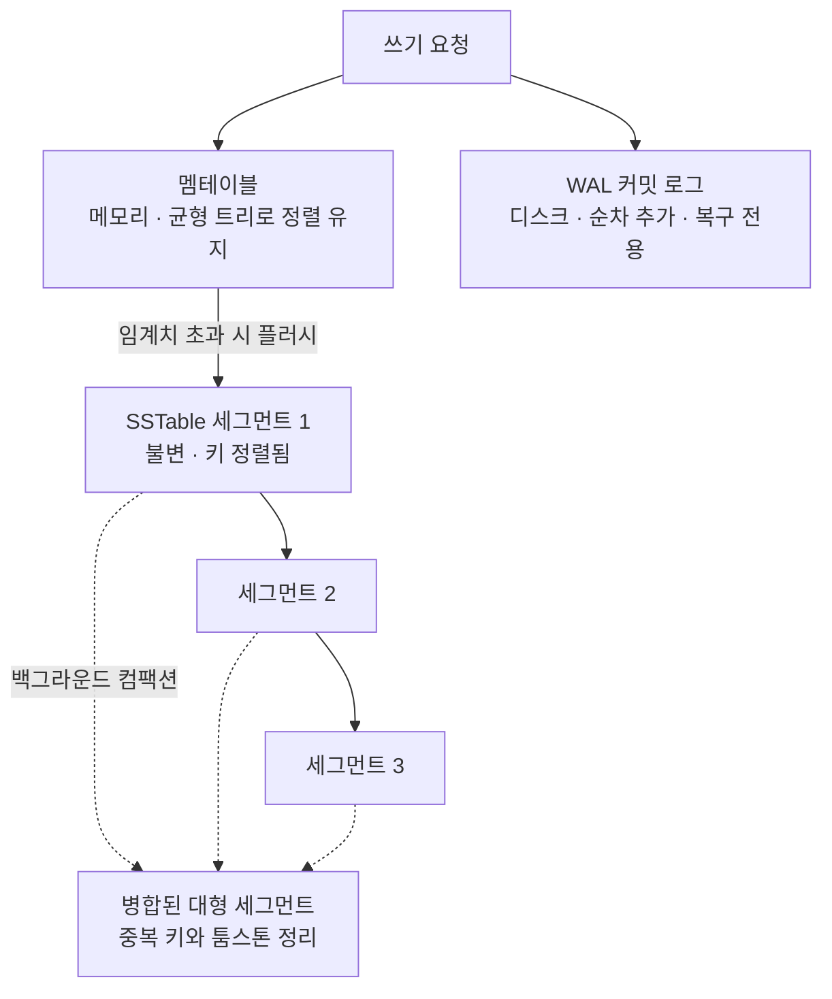
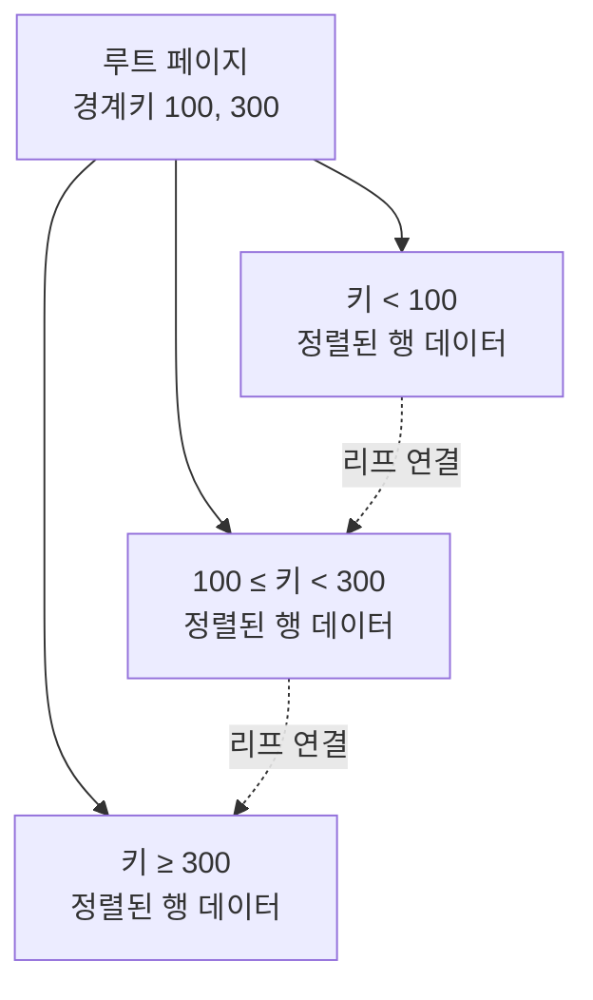
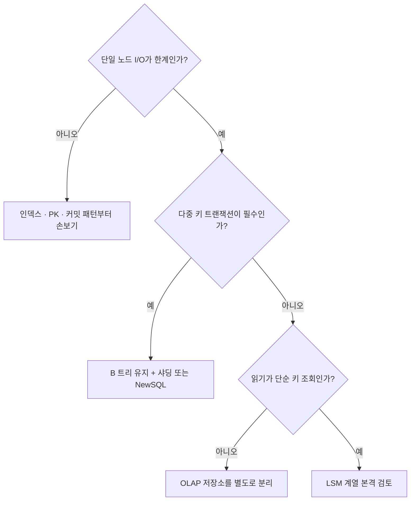
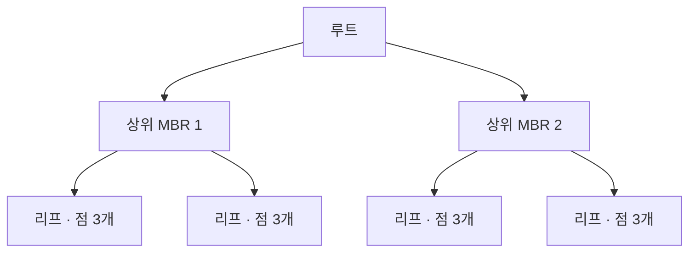
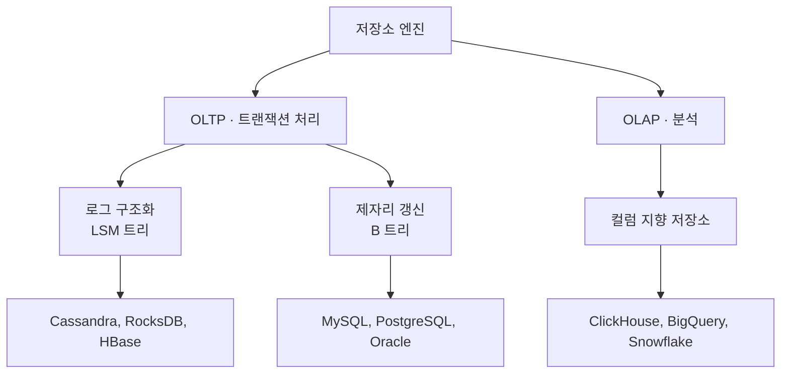

# DDIA 3장 — 저장소와 검색

> 데이터베이스에 데이터를 저장하면 내부에서 무슨 일이 일어나는가.
> 그리고 나중에 그 데이터를 질의하면 데이터베이스는 어떤 작업을 수행하는가.

이 장은 이 두 질문에 답한다. 저장소 엔진을 직접 만들 일은 없지만, **여러 저장소 엔진 중 하나를 골라야 하기 때문에** 내부 동작을 알아야 한다.

---

## 목차

1. [출발점 — 저장과 검색의 비대칭](#1-출발점--저장과-검색의-비대칭)
2. [로그 구조화 — 해시 색인에서 LSM 트리까지](#2-로그-구조화--해시-색인에서-lsm-트리까지)
3. [제자리 갱신 — B 트리](#3-제자리-갱신--b-트리)
4. [B 트리 vs LSM 트리 — 선택 기준](#4-b-트리-vs-lsm-트리--선택-기준)
5. [그 외 색인 구조](#5-그-외-색인-구조)
6. [OLTP vs OLAP — 컬럼 지향 저장소](#6-oltp-vs-olap--컬럼-지향-저장소)
7. [MySQL에서 PostgreSQL로 — 3장의 관점](#7-mysql에서-postgresql로--3장의-관점)
8. [한 장 요약](#8-한-장-요약)

---

## 1. 출발점 — 저장과 검색의 비대칭

### 세상에서 가장 간단한 데이터베이스

```bash
db_set () { echo "$1,$2" >> database; }
db_get () { grep "^$1," database | sed -e "s/^$1,//" | tail -n 1; }
```

두 줄이지만 이 장의 구조를 전부 담고 있다.

| | 동작 | 복잡도 |
|---|---|---|
| 쓰기 | 파일 끝에 한 줄 추가 | O(1), 순차 쓰기라 매우 빠름 |
| 읽기 | 파일 전체 스캔 | O(n) |

- 값을 갱신해도 기존 줄을 고치지 않는다. 새 줄을 또 붙인다
- 그래서 최신 값은 `tail -n 1`
- 이것이 **로그 구조화(log-structured)** 접근 방식의 원형이다

> 여기서 "로그"는 애플리케이션 로그가 아니라 **추가 전용(append-only) 레코드 연속**을 뜻한다.

**핵심은 비대칭이다.** 쓰기는 이미 최적에 가깝고, 문제는 언제나 읽기다.

### 색인의 본질

> 잘 선택한 색인은 읽기 질의 속도를 높이지만, **모든 색인은 쓰기 속도를 떨어뜨린다.**

- 색인은 **기본 데이터에서 파생된 추가 구조**다. 원본이 아니다
- 색인을 추가·삭제해도 DB 내용은 변하지 않는다. 질의 성능만 달라진다
- 대신 쓸 때마다 색인도 갱신해야 한다. 원본 1번 쓰기가 색인 N개 갱신으로 번진다

그래서 DB는 모든 컬럼에 자동으로 색인을 걸지 않는다. **어느 읽기를 빠르게 하고 어느 쓰기 비용을 감수할지**는 도메인을 아는 개발자가 정할 문제로 남겨둔다.

실무 번역: "인덱스 하나 더 걸까요?"는 언제나 "INSERT/UPDATE를 얼마나 희생할 겁니까?"와 같은 질문이다.

---

## 2. 로그 구조화 — 해시 색인에서 LSM 트리까지

### 3-1. 해시 색인

가장 단순한 색인 전략은 인메모리 해시맵이다.

```
메모리:  { "user:42" → 오프셋 1024,  "user:77" → 오프셋 2048 }
디스크:  [ .......... 추가 전용 로그 파일 .......... ]
```

- 쓰기: 로그 끝에 추가하고 해시맵의 오프셋 갱신
- 읽기: 해시맵에서 오프셋을 찾아 디스크의 그 위치를 바로 읽음. **디스크 탐색 1회**

Bitcask(Riak 기본 엔진)가 이 구조다. 키 종류는 적고 쓰기가 폭발적인 워크로드(조회수 카운터 등)에 적합하다.

**파일이 무한히 커지는 문제는 세그먼트 + 컴팩션으로 푼다.**

1. 로그를 일정 크기에서 끊어 **세그먼트** 파일로 분리
2. 닫힌 세그먼트는 더 이상 쓰지 않음 (불변)
3. 백그라운드에서 **컴팩션**: 각 키의 최신 값만 남기고 중복 제거
4. 새 파일을 만든 뒤 옛 파일 삭제 → 그동안에도 읽기·쓰기는 정상 동작

**해시 색인의 한계 두 가지**

| 한계 | 설명 |
|---|---|
| 메모리 제약 | 모든 키가 메모리에 들어가야 함 |
| 범위 질의 불가 | 해시는 순서가 없음 |

### 3-2. SSTable — 정렬을 도입하다

제약 하나를 추가한다. **세그먼트 파일 안에서 키를 정렬해두자.** 이것이 SSTable(Sorted String Table)이다.

제약 하나로 이점이 셋 따라온다.

**① 병합이 싸진다** — 머지소트의 병합 단계와 같다. 파일이 메모리보다 커도 문제없다. 같은 키가 여러 파일에 있으면 최신 세그먼트 것을 취한다.

**② 색인이 희소해진다** — 모든 키를 메모리에 둘 필요가 없다.

```
메모리 색인:   handbag → 10240,   handsome → 41216
찾는 키:       handiwork  (색인에 없음)
               → 두 키 사이에 있음 → 오프셋 10240부터 몇 KB만 스캔
```

그리고 이 구조 덕에 **범위 질의가 자연스럽게 가능해진다.**

**③ 압축이 가능하다** — 희소 색인의 두 지점 사이를 블록으로 묶어 압축 저장. 디스크 공간과 I/O 대역폭을 함께 아낀다.

### 3-3. LSM 트리

클라이언트는 키를 아무 순서로나 쓴다. 디스크 파일을 정렬 상태로 유지하는 건 비싸다.

**해법: 정렬은 메모리에서 한다.**



**쓰기 경로**

1. 쓰기가 오면 메모리의 정렬된 구조(**멤테이블**)에 넣는다. 정렬을 유지하면서 임의 삽입이 빨라야 하므로 레드블랙 트리나 스킵 리스트 같은 균형 구조를 쓴다
2. 동시에 **WAL**에 순차로 추가한다 (멤테이블은 메모리라 장애 시 소실되므로)
3. 멤테이블이 임계치(수 MB)를 넘으면 SSTable 파일로 통째로 내려쓴다. 이미 정렬돼 있으니 순차 쓰기
4. 그 사이 새 쓰기는 새 멤테이블이 받는다

**읽기 경로** — 순서를 거슬러 올라간다.

1. 멤테이블 → 있으면 끝
2. 가장 최신 SSTable 세그먼트 → 그 다음 → 그 다음...

**존재하지 않는 키를 조회할 때가 최악이다.** 모든 세그먼트를 다 뒤져야 "없다"고 답할 수 있다. 이것이 LSM의 읽기가 B 트리보다 불리한 근본 이유다.

→ **블룸 필터**로 완화한다. "이 세그먼트에 있을 수도 있다 / 확실히 없다"를 메모리에서 판정한다. 거짓 양성은 있어도 거짓 음성은 없다.

**삭제** — 추가 전용이라 지울 수 없으므로 **툼스톤(tombstone)** 이라는 삭제 마커를 추가한다. 컴팩션 때 실제로 버려진다. Cassandra 운영에서 툼스톤이 쌓여 읽기가 무너지는 이슈가 여기서 나온다.

**컴팩션 전략**

| 전략 | 방식 | 특징 |
|---|---|---|
| 크기 계층(size-tiered) | 비슷한 크기끼리 묶어 병합 | 쓰기 증폭 적음, 공간 증폭 큼 |
| 레벨(leveled) | 키 범위로 쪼개 레벨별 정리 | 공간·읽기 효율 좋음, 쓰기 증폭 큼 |

> **쓰기 증폭(write amplification)** — 애플리케이션이 요청한 쓰기 1건이 저장소 내부에서 여러 건의 실제 디스크 쓰기로 불어나는 현상. 성능뿐 아니라 SSD 수명에도 직접 영향을 준다.

### 용어 정리

| 용어 | 의미 |
|---|---|
| 로그 구조화 | 기존 데이터를 고치지 않고 끝에 추가만 하는 방식 |
| 세그먼트 | 일정 크기에서 끊은 로그 조각. 닫히면 불변 |
| SSTable | 키가 정렬된 세그먼트 파일 |
| 멤테이블 | 메모리에서 정렬을 유지하는 균형 트리 |
| 컴팩션 | 세그먼트를 병합하며 중복·삭제분을 정리 |
| WAL | 크래시 대비 순차 기록 로그 |
| 툼스톤 | 삭제 표시 마커 |

**한 줄 요약: 정렬은 메모리에서 하고, 디스크에는 순차 쓰기만 한다. 정리는 백그라운드로 미룬다.**

---

## 3. 제자리 갱신 — B 트리

1970년에 등장해 지금까지 거의 모든 관계형 DB의 기본 색인이다.

### 기본 구조

로그 구조화가 가변 크기 세그먼트를 순차로 쓴다면, B 트리는 데이터베이스를 **고정 크기 페이지**(보통 4KB)로 나눈다. 디스크도 고정 크기 블록 단위로 동작하므로 궁합이 좋다.



- 한 페이지가 **자식 페이지 참조를 여러 개** 가진다. 이 개수가 **분기 계수**, 보통 수백 개
- 조회는 루트에서 시작해 경계키를 보고 자식으로 내려간다

**분기 계수가 크다는 게 결정적이다.** 이진 트리는 두 갈래지만 B 트리는 수백 갈래다. 트리가 아주 얕아진다.

> 분기 계수 500, 4KB 페이지인 **4단계 트리는 256TB까지** 저장할 수 있다.

실무 의미: 수억 행 테이블에서도 **디스크 접근 3~4회면 임의의 행에 도달**한다. 상위 페이지는 대부분 버퍼 풀에 캐시되므로 실제 I/O는 1~2회다.

| | B 트리 | LSM 트리 |
|---|---|---|
| 키 하나 조회 | 어느 키든 3~4회 페이지 탐색 | 세그먼트 수에 비례 |
| 키가 없을 때 | 리프까지 가서 끝. 비용 동일 | 모든 세그먼트 확인 |

**B 트리는 조회 비용이 예측 가능하다.** p99 레이턴시를 보장해야 하는 OLTP에서 이 성질이 핵심이다.

### 삽입과 페이지 분할

- 기존 키 **갱신**: 리프 페이지를 찾아가 그 자리를 덮어쓴다 → **제자리 갱신(update-in-place)**
- 새 키 **삽입**: 담당 리프에 여유가 있으면 끼워 넣고 끝. 없으면 **페이지 분할**

```
[페이지 분할]
꽉 찬 페이지 → 반으로 쪼개 새 페이지 둘 → 부모에 경계키와 참조 추가
                                          → 부모도 꽉 차면 위로 전파
                                          → 최악의 경우 루트까지 → 트리 깊이 +1
```

분할은 **디스크 여러 페이지를 동시에 고치는 작업**이다. 중간에 장애가 나면 트리가 깨진다.

### 신뢰성 — WAL

그래서 B 트리 구현체는 거의 예외 없이 **쓰기 전 로그(Write-Ahead Log)** 를 둔다.

1. 페이지를 고치기 전에 무엇을 어떻게 고칠지 로그에 **순차로 추가**
2. 로그가 디스크에 안전히 기록된 뒤 페이지 수정
3. 장애 시 재시작하며 로그를 재생해 복구

InnoDB의 redo 로그가 이것이다. **제자리 갱신 진영도 결국 내구성은 추가 전용 로그에 기댄다.**

> 이 때문에 B 트리는 쓰기 한 번에 최소 두 번 디스크에 쓴다(WAL + 페이지). **B 트리의 쓰기 증폭**이 여기서 나온다.

### 동시성 — 래치

여러 스레드가 동시에 접근하면 분할 중인 트리를 다른 스레드가 읽을 수 있다. 그래서 자료구조를 보호하는 경량 락 **래치(latch)** 를 쓴다.

| | 보호 대상 | 지속 |
|---|---|---|
| 락 | 데이터의 논리적 일관성 (트랜잭션 단위) | 김 |
| 래치 | 자료구조의 물리적 일관성 | 매우 짧음 |

LSM은 세그먼트가 **불변**이라 읽기 쪽에 락이 필요 없다. 구조적 장점이다.

### B 트리와 B+ 트리

책은 뭉뚱그려 B 트리라 하지만 실무 DB는 전부 **B+ 트리**다.

| | B 트리 | B+ 트리 |
|---|---|---|
| 데이터 위치 | 내부 노드에도 값 저장 | **리프에만** 저장 |
| 리프 연결 | 없음 | 리프끼리 **연결 리스트** |

- 내부 노드에 값이 없으니 한 페이지에 키를 더 담는다 → 분기 계수 ↑ → 트리가 더 얕아짐
- **범위 질의가 극적으로 싸다.** 시작점만 트리 탐색으로 찾고 리프 연결을 따라 옆으로 읽으면 된다

`ORDER BY`, `BETWEEN`, 페이징이 빠른 이유가 이 리프 연결이다.

### 최적화 기법

| 기법 | 내용 |
|---|---|
| Copy-on-write | 제자리 수정 대신 새 위치에 쓰고 부모 참조 갱신. WAL 없이 복구 가능 (LMDB) |
| 키 축약 | 내부 노드는 경계 역할만 하므로 키를 축약 → 분기 계수 ↑ |
| 리프 순차 배치 | 리프를 디스크상 순서대로 배치 시도 |
| 형제 포인터 | B+ 트리의 리프 연결 리스트 |
| 프랙탈 트리 | 로그 구조화 아이디어를 빌려 랜덤 쓰기 감소 |

---

## 4. B 트리 vs LSM 트리 — 선택 기준

### 전체 비교

| | B 트리 | LSM 트리 |
|---|---|---|
| 쓰기 방식 | 제자리 덮어쓰기 + WAL | 추가 전용, 순차 |
| 쓰기 증폭 원인 | WAL 이중 기록, 페이지 단위 쓰기, 분할 | 컴팩션 재작성 |
| **증폭된 쓰기 성격** | **랜덤** | **순차** |
| 조회 비용 | 일정하고 예측 가능 | 세그먼트 수에 따라 변동 |
| 디스크 공간 | 페이지 단편화로 낭비 | 압축 + 단편화 없음 |
| 응답 시간 안정성 | 안정적 | 컴팩션 시 p99 튐 |
| 동시성 | 래치 필요 | 불변 세그먼트라 부담 적음 |
| 트랜잭션 | 키가 한 곳에만 있어 락 걸기 쉬움 | 같은 키가 여러 세그먼트에 존재 |

**둘 다 쓰기 증폭이 있다.** "B 트리는 증폭, LSM은 무증폭"이 아니라 **증폭의 성격이 다르다.** SSD 입장에서 같은 배수라도 순차가 훨씬 낫다. 이것이 LSM이 쓰기 처리량에서 유리한 진짜 이유다.

마지막 줄도 중요하다. B 트리는 각 키가 색인 내 **정확히 한 곳에만 존재**해 락을 걸기 쉽다. 관계형 DB가 40년간 B 트리를 고수하는 이유는 성능만이 아니라 **트랜잭션 시맨틱과의 궁합**이다.

### 엔진을 바꾸기 전에 확인할 것

**"쓰기가 많다"고 느끼는 시스템 대부분은 저장소 엔진 문제가 아니다.**

| 확인 항목 | 왜 |
|---|---|
| 인덱스 개수 | 인덱스 5개면 INSERT 1건이 쓰기 6건 |
| PK 설계 | 랜덤 PK → 순차형 변경만으로 성능이 배로 뛰는 경우가 흔함 |
| 커밋 패턴 | 건건이 커밋하면 fsync가 병목. 배치 커밋으로 묶기 |
| 동기 복제 설정 | 병목이 디스크가 아니라 복제 확인 대기일 수 있음 |
| 락 경합 | 핫 로우에 몰리면 디스크는 놀고 락만 기다림 |
| 버퍼 풀 크기 | 메모리 부족으로 페이지를 계속 올리고 내리는 중일 수 있음 |

### 판단 순서



### 쓰기가 많다는 것의 세 유형

| 유형 | 예시 | 적합 |
|---|---|---|
| **삽입 위주** | 이벤트 로그, 감사 로그, 시계열 메트릭 | LSM 압도적 |
| **갱신 위주** | 카운터, 세션 상태, 재고 | LSM도 좋지만 B 트리도 버퍼 풀이 흡수. 트랜잭션 필요하면 B 트리 |
| **혼합 + 복잡한 읽기** | 일반 업무 시스템 | B 트리. 조인·범위·정렬이 섞이면 대안 없음 |

**같은 시스템 안에서도 테이블마다 다르다.** 전체 DB를 바꾸는 게 아니라 **쓰기가 터지는 테이블만 떼어내는 것**이 보통 가장 현실적이다.

### 실제 사례

| 사례 | 선택 | 이유 |
|---|---|---|
| 페이스북, InnoDB → MyRocks | B 트리 → LSM | 같은 MySQL 인터페이스 유지. 목적은 **저장 공간 절감**과 SSD 수명 |
| 디스코드, Cassandra → ScyllaDB | LSM → LSM | 계열은 유지, 구현체만 교체. 컴팩션·GC로 인한 p99 지연이 문제 |
| 우버, 스키마리스 | B 트리 유지 | 성숙도를 택하고 확장은 샤딩 계층으로 |

**엔진 교체는 "쓰기가 느려서"보다 "저장 비용, 수명, 꼬리 지연" 때문에 일어난다.**

### 자주 보이는 오해

- **"쓰기 많으니 NoSQL"** — Cassandra를 고르는 실제 이유는 LSM이 아니라 **마스터리스 복제와 자동 파티셔닝**인 경우가 많다. 저장소 엔진(3장)과 분산 모델(5·6장)은 다른 축인데 묶여서 팔린다. LSM만 원하면 MyRocks처럼 SQL을 유지하는 선택지도 있다
- **"LSM은 읽기가 느리다"** — 정확히는 **키가 없을 때와 세그먼트가 쌓였을 때** 느리다. 진짜 약한 건 복잡한 조인·다중 조건 필터·정렬이다

---

## 5. 그 외 색인 구조

### 보조 색인

기본키가 아닌 컬럼의 색인. 차이는 **키가 유일하지 않다**는 점뿐이다. 값을 행 식별자 목록으로 두거나, 행 번호를 덧붙여 유일하게 만든다.

InnoDB 세컨더리 인덱스는 `(컬럼값, PK값)` 조합으로 정렬된다. 덕분에 `WHERE status = 'A' ORDER BY id`가 정렬 없이 처리된다.

### 연쇄 색인 — 왼쪽 접두사 규칙

```sql
CREATE INDEX idx ON users (last_name, first_name);
-- 키: "kim|minsoo", "kim|younghee", "lee|jisoo" ...
```

| 질의 | 색인 사용 |
|---|---|
| `WHERE last_name = '김'` | ✅ |
| `WHERE last_name = '김' AND first_name = '민수'` | ✅ |
| `WHERE first_name = '민수'` | ❌ |

전화번호부와 같다. 성으로 찾는 건 쉽지만 이름만으로는 전체를 훑어야 한다. **복합 인덱스의 컬럼 순서가 성능을 좌우한다.**

### R 트리 — 다차원 색인

연쇄 색인은 결국 **한 줄로 세운 순서**라 진짜 2차원 질의에서 무너진다.

```sql
SELECT * FROM restaurants
WHERE latitude  BETWEEN 37.4 AND 37.6
  AND longitude BETWEEN 126.9 AND 127.1;
```

`(latitude, longitude)` 연쇄 색인은 위도 범위의 모든 행을 가져온 뒤 경도로 **필터링만** 한다. 두 번째 조건이 범위를 좁혀주지 못한다.

R 트리는 1차원으로 세우지 않고 **영역 자체를 계층으로 묶는다.** 핵심 개념이 **MBR(최소 경계 사각형)** 이다.

```
┌──── 상위 MBR ─────┐      ┌───── 상위 MBR ──────┐
│ ┌─리프─┐          │      │  ┌─리프─┐           │
│ │ ●● ● │          │      │  │ ● ●● │           │
│ └──────┘          │      │  └──────┘           │
│        ┌─리프─┐   │      │         ┌─리프─┐    │
│        │ ●●●  │   │      │         │ ● ●● │    │
│        └──────┘   │      │         └──────┘    │
└───────────────────┘      └─────────────────────┘

질의 영역과 겹치지 않는 사각형은 그 아래 전체를 건너뜀
```



| | B 트리 | R 트리 |
|---|---|---|
| 키 | 1차원 스칼라 | n차원 경계 상자 |
| 자식 구분 | 겹치지 않는 구간 | **겹칠 수 있는** 영역 |
| 탐색 | 한 경로로 내려감 | 여러 가지를 동시에 타야 할 수 있음 |

세 번째가 약점이다. MBR이 겹치면 여러 서브트리를 다 봐야 한다. R\*-트리 같은 변종이 겹침 최소화 분할을 쓴다.

**구현체** — PostGIS(GiST 기반, 공간 데이터 표준), MySQL `SPATIAL INDEX`, Oracle Spatial.

**대안: 공간 채움 곡선** — 지오해시, Z-order, 힐베르트 곡선. 2차원을 비트 교차로 1차원으로 접어서 **기존 B 트리 범위 질의**로 근접 검색을 한다. Redis `GEO`가 이 방식이다. 정밀도는 떨어지지만 기존 인덱스 인프라를 그대로 쓴다.

> 다차원 색인은 지리 정보 전용이 아니다. `(RGB 범위)` 상품 색상 검색, `(날짜 범위, 온도 범위)` 기상 검색처럼 **두 개 이상의 범위 조건을 동시에 좁혀야 하는 모든 질의**가 해당한다.

### 전문 검색과 퍼지 색인

Lucene / Elasticsearch의 핵심은 **역색인(inverted index)** 이다.

```
문서 1: "인증 서버 오류"
문서 2: "인증 토큰 만료"

역색인:  인증 → [1, 2]
         서버 → [1]
         토큰 → [2]
```

일반 색인이 "행 → 값"이라면 역색인은 **"단어 → 그 단어를 포함한 문서 목록"** 이다.

퍼지 검색은 단어 목록을 유한 상태 오토마톤으로 저장하고, 이를 **레벤슈타인 오토마타**로 변환해 편집 거리 N 이내의 단어를 한 번에 찾는다. 그래서 오타를 쳐도 검색된다.

> Lucene의 세그먼트 구조는 **불변 파일 + 백그라운드 병합**이라 LSM 트리와 발상이 사실상 같다.

### 인메모리 데이터베이스

| 제품 | 지속성 |
|---|---|
| Memcached | 없음 (캐시 전용) |
| Redis | 스냅숏 + AOF 로그로 약한 지속성 |
| VoltDB, MemSQL | 복제와 로그로 지속성 확보 |

**흔한 오해**: 인메모리 DB가 빠른 이유는 "디스크를 안 읽어서"가 아니다. 디스크 기반 DB도 자주 쓰는 데이터는 OS 페이지 캐시에 있다.

진짜 이유는 **디스크용으로 부호화하는 오버헤드가 없다는 것**이다. 메모리 내 자료구조를 그대로 쓴다. Redis가 리스트·셋·정렬된 셋을 명령으로 제공하는 게 이 덕분이다.

**안티 캐싱** — 최근에 안 쓴 데이터를 디스크로 내리고 다시 접근하면 올린다. OS 스와핑과 비슷하지만 레코드 단위라 더 정교하다.

### 색인 요약

| 색인 | 용도 | 대표 |
|---|---|---|
| B+ 트리 | 범용, 정확한 값과 범위 | 모든 RDBMS |
| LSM 트리 | 쓰기 집약 | Cassandra, RocksDB |
| 해시 색인 | 정확한 키 조회만 | Bitcask, Redis |
| 연쇄 색인 | 다중 컬럼, 왼쪽 접두사 | RDBMS 복합 인덱스 |
| R 트리 | 다차원 범위 질의 | PostGIS, MySQL SPATIAL |
| 역색인 | 전문 검색, 퍼지 매칭 | Lucene, Elasticsearch |

---

## 6. OLTP vs OLAP — 컬럼 지향 저장소

### 두 워크로드

| | OLTP | OLAP |
|---|---|---|
| 읽기 패턴 | 키로 소수의 레코드 | 수백만 행 스캔 후 집계 |
| 필요한 컬럼 수 | 행 전체 | 전체 중 **3~5개** |
| 쓰기 패턴 | 사용자 요청 기반 임의 쓰기 | 벌크 적재, 이벤트 스트림 |
| 병목 | 디스크 **탐색 시간** | 디스크 **대역폭** |
| 대표 질의 | `SELECT * FROM orders WHERE id = 42` | `SELECT region, SUM(amount) ... GROUP BY region` |

두 번째 질의는 컬럼 2개만 필요한데, 행 지향 저장소는 **행 전체를 읽는다.** 컬럼이 100개면 98개는 버리려고 읽는 셈이다.

### 왜 분리하는가

- 무거운 스캔이 버퍼 풀을 밀어내고 OLTP 응답 시간을 망가뜨린다
- 분석가에게 운영 DB 접근 권한을 주는 건 사고 위험이 크다
- 여러 시스템의 데이터를 모아야 의미 있는 분석이 된다

→ **데이터 웨어하우스**를 따로 두고 ETL로 읽기 전용 사본을 옮겨 담는다.

**별 모양 스키마** — 가운데 **사실 테이블**(이벤트 하나가 한 행, 수십억 행), 주위에 **차원 테이블**(누가·무엇을·어디서·언제).

### 컬럼 지향 저장소

> 행의 모든 값을 함께 저장하지 말고, **각 컬럼의 모든 값을 함께 저장하자.**

```
[ 행 지향 ] — 한 행의 값들이 붙어 있음
 id 지역 금액 │ id 지역 금액 │ id 지역 금액 │ id 지역 금액
┌──┬────┬───┐┌──┬────┬───┐┌──┬────┬───┐┌──┬────┬───┐
│1 │서울│100││2 │부산│200││3 │서울│300││4 │대구│150│
└──┴────┴───┘└──┴────┴───┘└──┴────┴───┘└──┴────┴───┘

[ 열 지향 ] — 같은 컬럼 값들이 붙어 있음
      id 파일      │      지역 파일       │      금액 파일
┌──┬──┬──┬──┐  ┌────┬────┬────┬────┐  ┌───┬───┬───┬───┐
│1 │2 │3 │4 │  │서울│부산│서울│대구│  │100│200│300│150│
└──┴──┴──┴──┘  └────┴────┴────┴────┘  └───┴───┴───┴───┘
```

**컬럼별 파일에서 행 순서가 동일해야 한다.** n번째 항목끼리 모으면 원래 행이 복원된다.

`GROUP BY region`이면 지역·금액 파일 두 개만 읽는다. 나머지는 디스크에서 건드리지도 않는다.

### 컬럼 압축

같은 컬럼 값들은 타입이 같고 종류가 제한적이라 압축이 잘 듣는다.

**비트맵 인코딩**

```
지역 컬럼:   서울, 부산, 서울, 대구, 부산, 서울

서울 비트맵:  1 0 1 0 0 1
부산 비트맵:  0 1 0 0 1 0
대구 비트맵:  0 0 0 1 0 0
```

여기에 **런 렝스 인코딩**을 얹으면 더 줄어든다(`0 0 0 1 0 0` → "0이 3개, 1이 1개, 0이 2개").

진짜 힘은 **질의 처리 자체가 비트 연산이 된다**는 점이다.

```sql
WHERE region IN ('서울','부산')             → 두 비트맵 OR
WHERE region = '서울' AND status = 'PAID'   → 두 비트맵 AND
```

**벡터화 처리** — 압축된 컬럼 데이터는 CPU L1 캐시에 통째로 올라간다. 분기 없는 타이트한 루프와 SIMD 명령을 쓸 수 있다. 디스크 대역폭뿐 아니라 CPU 사이클까지 아낀다.

### 정렬 순서

- 자주 쓰는 필터 컬럼(날짜 등)으로 정렬하면 해당 범위만 읽고 끝낼 수 있다
- 정렬된 컬럼은 같은 값이 연속되므로 **런 렝스 압축이 극적으로 잘 듣는다**
- 단, **행 단위로 정렬해야 한다.** 컬럼별로 따로 정렬하면 행 복원이 불가능하다

C-Store는 같은 데이터를 **여러 정렬 순서로 복제 저장**해 질의 패턴에 맞는 것을 고른다.

### 컬럼 지향에 쓰기

정렬된 압축 컬럼 한가운데에 행을 끼워 넣으려면 모든 파일을 다시 써야 한다. 해법이 **LSM과 완전히 같다.**

1. 새 쓰기는 메모리의 정렬된 구조에 모은다
2. 충분히 쌓이면 디스크 컬럼 파일에 **일괄 병합**
3. 질의는 디스크와 메모리 데이터를 함께 본다

ClickHouse의 **MergeTree** 엔진 이름이 여기서 왔다.

### 구체화 뷰와 데이터 큐브

- **구체화 뷰**: 질의 결과를 실제로 저장한 사본. 원본이 바뀌면 갱신 비용 발생
- **데이터 큐브**: 차원 조합별 집계를 격자로 미리 계산

빠르지만 **유연성을 잃는다.** 미리 계산한 조합 외의 질문에는 답할 수 없다.

### 책 이후의 흐름

| 구분 | 현재 |
|---|---|
| 클라우드 웨어하우스 | Snowflake, BigQuery, Redshift — 저장·연산 분리 |
| 오픈소스 OLAP | ClickHouse, Druid, Pinot |
| 컬럼 파일 포맷 | **Parquet, ORC** — 이 장의 구조가 그대로 파일 규격이 됨 |
| 테이블 포맷 | Iceberg, Delta Lake — 객체 스토리지 위 트랜잭션 |
| 통합 시도 | HTAP — TiDB, SingleStore |

---

## 7. MySQL에서 PostgreSQL로 — 3장의 관점

### 추세는 실재한다

| 지표 | 내용 |
|---|---|
| 스택 오버플로 2025 | PostgreSQL 55.6% vs MySQL 40.5%. PostgreSQL 첫 1위 |
| DB-Engines 2026.7 | MySQL 846.46점(전년 대비 -94.27), PostgreSQL 687.80점(+6.92) |
| 도커 허브 이미지 | postgres : mysql ≈ 3.8 : 1 |

**설치 기반은 MySQL이 크고, 성장은 PostgreSQL이 가져간다.** 신규 프로젝트의 기본 선택이 바뀌었다.

### 그런데 3장 관점에서는 이상하다

**저장과 검색 구조만 놓고 보면 InnoDB가 유리한 부분이 많다.**

| | InnoDB | PostgreSQL |
|---|---|---|
| 테이블 구조 | PK 클러스터드 인덱스 = 테이블 | 힙(순서 없음) |
| 세컨더리 인덱스가 가리키는 것 | **PK 값** | **ctid**(물리적 위치) |
| 갱신 방식 | 제자리 갱신 + undo 로그 | 새 버전 튜플을 **추가**, 옛 버전은 남김 |
| 옛 버전 정리 | undo 로그 purge | **VACUUM** |

PostgreSQL의 `UPDATE` 한 번에 벌어지는 일:

1. 새 버전 튜플을 힙에 쓴다 → **새 ctid 생성**
2. 옛 ctid를 가리키던 **모든 인덱스**가 새 ctid를 가리키도록 갱신된다

인덱스가 12개인 테이블에서 그중 하나만 커버하는 컬럼을 수정해도 12개 전부에 전파된다.

InnoDB는 세컨더리 인덱스가 물리 위치가 아니라 **PK 값**을 가리키므로 이 문제가 없다.

> InnoDB에서 세컨더리 인덱스 조회가 2단계라는 단점은, 갱신할 때 인덱스를 안 건드려도 된다는 장점과 같은 동전의 양면이다.

**우버가 2016년에 PostgreSQL → MySQL로 간 이유가 정확히 이것이다.** 쓰기 증폭이 복제 계층으로도 번졌다. PostgreSQL은 물리적 WAL을 그대로 보내고 MySQL은 논리적 binlog를 보내므로, 단순 갱신 하나가 여러 건의 전송으로 불어났다.

여기에 VACUUM 부담이 더해진다. 옛 튜플이 즉시 회수되지 않아 **테이블·인덱스 블로트**가 생기고, autovacuum이 밀리면 성능이 서서히 무너진다.

> 완화 장치는 있다. **HOT(Heap-Only-Tuples)** 갱신은 인덱스를 전혀 건드리지 않는다. 단 인덱스된 컬럼이 안 바뀌고 같은 페이지에 공간이 있어야 한다. 조건부 최적화라 구조적 부담 자체가 사라지진 않는다.

### 그럼 왜 PostgreSQL이 이기고 있나

정직하게 말하면 **전환의 주된 동력은 3장 바깥에 있다.** 라이선스와 거버넌스, 클라우드 벤더 투자, 표준 SQL 준수, 타입 시스템 등이다.

**다만 3장의 언어로 설명되는 이유가 딱 하나 있고, 그게 가장 중요하다.**

| | MySQL | PostgreSQL |
|---|---|---|
| 교체 가능한 것 | **저장소 엔진** (InnoDB, MyRocks, Memory…) | **색인 접근 방법** (access method) |
| 고정된 것 | 색인 종류 | 저장 구조 (힙 + MVCC) |

PostgreSQL은 색인 접근 방법 자체가 플러그인이다.

| 접근 방법 | 용도 |
|---|---|
| B-tree | 일반 값·범위 |
| Hash | 동등 비교 전용 |
| **GiST** | R 트리 계열. 공간 데이터, 범위 타입 |
| **SP-GiST** | 비균형 분할. 쿼드트리, 트라이 |
| **GIN** | 역색인. 배열, JSONB, 전문 검색 |
| **BRIN** | 블록 범위 요약. 거대한 시계열 테이블 |

그리고 확장으로 **새 색인 구조를 추가할 수 있다.** PostGIS가 공간 색인을, pgvector가 벡터 유사도 검색(HNSW, IVFFlat)을 이렇게 얹는다.

**즉 3장의 관점에서 승부를 가른 건 "저장소 엔진의 성능"이 아니라 "색인 접근 방법의 확장성"이다.**

MySQL은 **저장 방식**을, PostgreSQL은 **검색 방식**을 갈아끼울 수 있게 설계했다. 지난 10년간 시장이 요구한 것은 새로운 저장 방식이 아니라 **새로운 검색 방식**이었다. JSON 문서 검색, 전문 검색, 지리 검색, 시계열 요약, 그리고 벡터 유사도 검색.

### 균형 잡힌 결론

| 관점 | 유리한 쪽 |
|---|---|
| 단순 PK 조회, 읽기 편중 | MySQL (클러스터드 인덱스) |
| 인덱스가 많은 갱신 집약 | MySQL (인덱스 갱신 회피) |
| 수평 샤딩 성숙도 | MySQL (Vitess) |
| 복잡한 질의, 다양한 타입 | PostgreSQL |
| 새로운 색인 요구(JSON·공간·벡터·전문) | PostgreSQL |
| 생태계 성장, 인력 수급 | PostgreSQL |

인터넷의 "몇 배 빠르다" 류 벤치마크는 설정과 워크로드에 따라 결론이 뒤집힌다. **3장의 결론 그대로, 자신의 워크로드로 직접 재보는 것 외에 답이 없다.**

---

## 8. 한 장 요약

### 이 장의 구조



### 기억할 문장 다섯 개

1. **모든 색인은 읽기를 사는 대가로 쓰기를 판다.** 어느 쪽을 살지는 개발자가 정한다
2. **디스크는 순차 쓰기를 임의 쓰기보다 훨씬 잘한다.** 이 제약이 로그 구조화와 제자리 갱신을 갈랐다
3. **LSM은 정렬을 메모리에서 하고 디스크에는 순차로만 쓴다.** 정리는 백그라운드로 미룬다
4. **B 트리는 조회 비용이 예측 가능하고, 키가 한 곳에만 있어 락을 걸기 쉽다.** RDBMS가 40년간 고수하는 이유다
5. **OLTP는 탐색 시간과, OLAP는 대역폭과 싸운다.** 그래서 행 지향과 열 지향으로 갈린다
