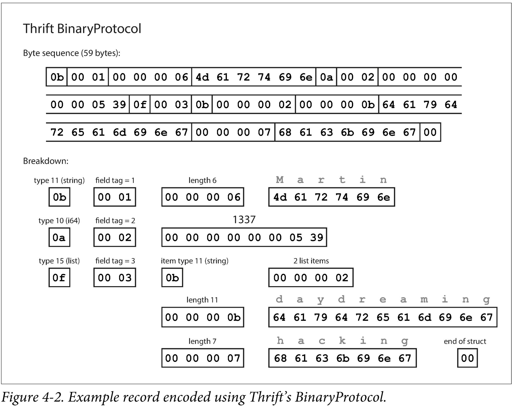

# 목표

서비스가 독립적으로 배포되면 신/구 버전 코드가 동시에 실행된다. 이때 부호화 형식이 버전 간 호환성을 어떻게 보장하는지 이해한다.

# 데이터 부호화란?

메모리 안의 객체는 포인터로 연결되어 있는데, 포인터는 그 프로세스 안에서만 의미가 있다. 그래서 파일에 쓰거나 네트워크로 보내려면 바이트열로 바꿔야 한다.

- **부호화(encoding)**: 메모리 구조 → 바이트열
- **복호화(decoding)**: 바이트열 → 메모리 구조

# 호환성

대규모 애플리케이션에서는 신/구 버전 코드가 공존한다.
- 서버: 롤링 업그레이드로 일부 노드부터 점진 배포
- 클라이언트: 사용자가 업데이트를 안 할 수 있음

그래서 부호화 형식은 두 방향 호환을 모두 지원해야 한다.

- **하위 호환(backward)**: 새 코드가 옛 데이터를 읽음. 새 코드는 옛 형식을 아니까 비교적 쉽다.
- **상위 호환(forward)**: 옛 코드가 새 데이터를 읽음. 미래 형식을 처리해야 해서 어렵다. 보통 모르는 필드는 무시한다.

# 텍스트 기반 부호화: JSON, XML

언어에 종속되지 않고 사람이 읽을 수 있어서 조직 간 데이터 교환에 널리 쓰인다.

**JSON**

```json
{
  "name": "인엽",
  "age": 28,
  "skills": ["Kotlin", "Spring"]
}
```

- 장점: 문법이 단순, 웹/REST API의 사실상 표준
- 단점: 정수와 부동소수점 구분 없음(2^53 초과 정수 정밀도 손실), 바이너리는 Base64 필요(크기 33% 증가), 스키마가 선택적

**XML**

```xml
<user>
    <name>인엽</name>
    <age>28</age>
    <skills>
        <skill>Kotlin</skill>
        <skill>Spring</skill>
    </skills>
</user>
```

- 장점: 스키마(XSD)로 구조 검증 가능
- 단점: 장황함, 숫자와 문자열 구분 없음, 스키마 언어가 복잡

# 이진 부호화

텍스트 형식은 데이터마다 필드 이름이 반복해서 들어간다. 이진 부호화는 스키마를 미리 정의해두고 **실제 값 위주로** 표현해서 더 작다.

## Thrift, Protocol Buffers

스키마(IDL)를 정의하고, 스키마로 각 언어의 코드를 생성한다.

```
message Person {
  required string user_name = 1;
  optional int64 favorite_number = 2;
  repeated string interests = 3;
}
```

부호화된 데이터에는 필드 이름이 없고 **태그 번호 + 타입 + 값**만 들어간다. 받는 쪽은 태그 번호로 필드를 찾으므로 **이름은 바꿔도 되지만 번호는 바꾸면 안 된다.**



**스키마 진화 규칙**
- 필드 추가: 새 태그 번호로 추가 → 양방향 호환 (옛 코드는 모르는 태그를 건너뜀, 새 코드는 없는 필드를 기본값으로)
- 필드 삭제: 태그 번호 **재사용 금지**. 옛 코드가 값을 잘못 해석한다. `reserved`로 막아둔다


## Avro

Hadoop용으로 만들어졌고, **태그 번호가 없다.** 값만 이어 붙여서 셋 중 가장 작다.

> 하둡(Hadoop)은 **아주 큰 데이터를 여러 대의 컴퓨터에 나눠 저장하고, 나눠서 처리하는 오픈소스 프레임워크**

```
record Person {
  string userName;
  union { null, long } favoriteNumber = null;
  array<string> interests;
}
```

바이트만으로는 어떤 값이 어떤 필드인지 모르므로, **쓸 때 사용한 스키마를 알아야** 읽을 수 있다.

- **쓰기 스키마(writer)**: 부호화할 때 쓴 스키마
- **읽기 스키마(reader)**: 읽는 코드가 기대하는 스키마
- 둘은 **같을 필요 없이 호환되기만 하면 된다.** 필드 이름으로 맞춰서, 쓰기에만 있는 필드는 무시하고 읽기에만 있는 필드는 기본값으로 채운다.

# 부호화가 실제로 어디서 일어나고, 누가 쓰고 누가 읽나

## 데이터베이스

저장할 때 부호화, 읽을 때 복호화한다. **데이터는 코드보다 오래 산다.** 수년 전 데이터를 새 코드가 읽어야 한다(하위 호환). 그래서 보통 마이그레이션 대신 새 컬럼을 추가하고 옛 데이터는 null로 둔다.

마이그레이션
```
ALTER TABLE user ADD COLUMN email VARCHAR(100);
UPDATE user SET email = CONCAT(name, '@old-domain.com');  -- 기존 1억 행을 전부 수정
```

컬럼만 추가(+기본값 null)
```
ALTER TABLE user ADD COLUMN email VARCHAR(100) NULL DEFAULT NULL;
```
옛 행을 읽을 때 `email` 값이 없으면 DB가 **읽는 시점에 null로 채워서** 돌려준다.


## 서비스: REST와 RPC

마이크로서비스는 서비스별로 독립 배포하는 게 목표라, 서비스 간 API는 신/구 버전이 섞여도 동작해야 한다.

- **REST**: HTTP 위의 설계 철학. URL로 리소스 식별, 보통 JSON. 외부 공개 API에 주로 쓴다.
- **RPC**: 원격 호출을 로컬 함수 호출처럼 보이게 하는 모델. 내부 서비스 간 통신에 주로 쓴다.

**RPC의 문제**: 네트워크 호출은 로컬 호출과 근본적으로 다르다.
- 유실, 타임아웃이 날 수 있고, 타임아웃 시 처리 여부를 알 수 없다. 재시도하면 중복 실행될 수 있다.
- 응답 시간이 들쭉날쭉하다.

**서비스의 호환성**: 보통 서버를 먼저 배포한다.
- 요청은 하위 호환 (새 서버가 옛 요청을 읽음)
- 응답은 상위 호환 (옛 클라이언트가 새 응답을 읽음)
- 호환성은 부호화 형식을 따라간다. gRPC는 Protobuf 규칙, REST는 JSON에 선택 필드 추가

## 비동기 메시지 전달

RPC처럼 메시지를 다른 프로세스에 보내지만, 직접 보내지 않고 **메시지 브로커**를 거친다는 점은 DB와 비슷하다. 보내는 쪽은 응답을 기다리지 않는다.

**브로커의 장점**
- 수신자가 죽어 있어도 메시지를 보관했다가 전달 → 유실 방지
- 송신자가 수신자를 몰라도 됨 (느슨한 결합)
- 하나의 메시지를 여러 수신자가 받을 수 있음 (발행/구독)

**호환성**
- 메시지는 그냥 바이트열이라 어떤 부호화든 쓸 수 있다.
- 프로듀서와 컨슈머가 독립 배포되므로 양방향 호환이 필요하다.
- 브로커에 옛 메시지가 남아 있을 수 있어서, 컨슈머는 신/구 메시지를 모두 읽어야 한다.


# 딥다이브 실습
→ [ddia-msa-practice (ch04-done)](https://github.com/Afdddd/ddia-msa-practice)
